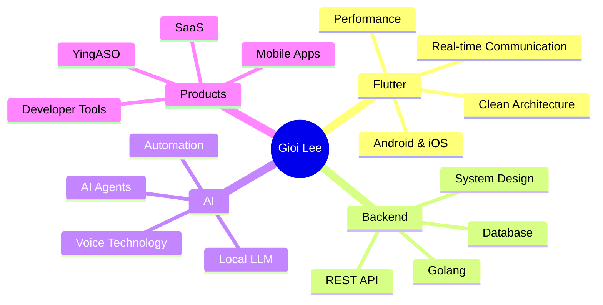

<div align="center">


<a href="https://github.com/hunggioi">
  
</a>

<br/>


</div>

---

## 👨‍💻 About Me

```dart
class Developer {
  final String name = "Gioi Lee";
  final String username = "hunggioi";
  final String location = "Vietnam 🇻🇳";

  final List<String> roles = [
    "Flutter Developer",
    "Indie Maker",
    "AI Enthusiast",
  ];

  final List<String> currentlyLearning = [
    "Golang",
    "Backend Architecture",
    "AI Agents",
    "Local LLMs",
  ];

  final String currentProject = "YingASO";
  final String goal = "Build useful products that solve real problems";
}
````

* 💙 I build cross-platform mobile applications with **Flutter**
* 📱 Experienced in Android and iOS application development
* 🤖 Interested in **AI, automation, voice technology and local LLMs**
* 🚀 Building SaaS products and developer tools
* 🌱 Currently learning **Golang and backend architecture**
* 🎯 Focused on clean architecture, performance and user experience
* 💬 Ask me about Flutter, Firebase, WebRTC, LiveKit or mobile development
* ⚡ Fun fact: I enjoy turning small ideas into real products

---

## 🛠️ Tech Stack

<div align="center">

### Mobile Development


### Backend & Database


### Web & Cloud


### Tools


</div>

---

## 💡 What I Work With

<div align="center">


</div>

---

## 🚀 Featured Projects

<table>
<tr>
<td width="50%" valign="top">

### 📈 YingASO

An ASO platform designed to help indie developers improve organic app installs.

**Key features**

* App audit
* Keyword opportunity score
* Competitor keyword gap
* Metadata optimization
* Keyword rank tracking
* Weekly ASO action plan

**Tech**

`Flutter` `SaaS` `AI` `ASO` `Firebase`

</td>

<td width="50%" valign="top">

### 🦄 Baby Unicorn Coloring Book

A colorful and kid-friendly drawing application built with Flutter.

**Key features**

* Coloring pages
* Glitter brush
* Stickers
* Offline support
* Save and share artwork
* Kid-friendly interface

**Tech**

`Flutter` `Dart` `Android` `AdMob`

</td>
</tr>

<tr>
<td width="50%" valign="top">

### 📞 Real-Time Communication

Mobile communication features for voice calls, video calls and chat.

**Key features**

* WebRTC calling
* LiveKit integration
* Incoming call UI
* Floating call window
* Call state management
* Audio and video controls

**Tech**

`Flutter` `WebRTC` `LiveKit` `FCM`

</td>

<td width="50%" valign="top">

### 🤖 AI & Automation Tools

Experiments with local AI models, voice cloning and developer automation.

**Areas**

* Local LLMs
* Text-to-speech
* Voice cloning
* AI agents
* Prompt engineering
* OpenAI API

**Tech**

`Python` `OpenAI` `Ollama` `TTS`

</td>
</tr>
</table>

---

## 📊 GitHub Analytics

<div align="center">


</div>

<br/>

<div align="center">


</div>

---

## 📈 Contribution Activity

<div align="center">


</div>

---

## 🏆 GitHub Trophies

<div align="center">


</div>

---

## 🎯 Current Focus



---

## 🤝 Let's Connect

<div align="center">

<a href="https://github.com/hunggioi">
  
</a>

<a href="mailto:gioivp113@gmail.com">
  
</a>

<a href="https://www.linkedin.com/in/h%C3%B9ng-gi%E1%BB%8Fi-751a881b8/">
  
</a>

</div>

---

<div align="center">

### 💬 Developer Quote

> “Great products are built one small improvement at a time.”

<br/>


<br/>


</div>
